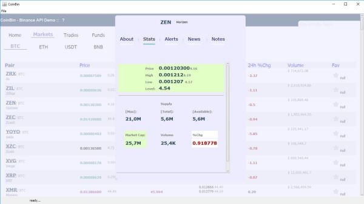

<table style="margin: 0 auto; max-width: 900px" align="center">
	<tr>
		<td>
<strong>- About:</strong> CoinBin is an abstract attempt to use the javafx 
browser and sqlite to deploy and maintain simple desktop applications.  This 
example uses the Binance Java API to render realtime data using html, javascript and 
an sqlite database. Alot of the code is from a similar project that uses 
		javafx, android and a 
LAMP stack (e-commerce demo), basically for the same deploy and maintain purposeses. 
		No sucurity exploits checking, refactoring, form-connection validation, 
		etc. are enforced with CoinBin code. The code 
is written, rewritten and mashed according to the current imagination spool. 
		It is what it is. Use it at your own risk.  
		

		
...

<strong>- Structure:</strong> conbin.db // sqlite database file 
dbschema.txt //sql structure file read by the njfbrowser\utils\UtilSQLAdapter to 
create database Launch.java // simple class that calls njfbrowser\main\CoinBin 
sunCompile.bat // windows .bat file executes java 
compiler sunRun.bat // windows .bat file executes java 
Launch.class 
/cbox // preference files used in java app 
/com // binance api java code, some 
of it was modified. /html // html files, 
js, css used by java browser. home page is index.php 
/lib 
// bunch of open-sourced java libraries used by this app 
/njfbrowser // main 
java files used by this app /org // the simple web server and rss reader 
 <strong>- Usage:</strong> double clicking the sunRun.bat will launch 
CoinBin. If needed, edit the bat file in a text editor to point to your java 
executable. Dont forget to include the lib/ and other packages in your 
classpath. The main class 
njfbrowser\main\CoinBin uses 
njfbrowser\BinanceHelper to parse Binance API and&nbsp; 
njfbrowser\utils\UtilSQLAdapter to connect to the coinbin.db sqlite 
database. On llaunch, CoinBin will create/connect to the database and start a 
simple web server. The java browser will&nbsp; then open page
<a href="http://localhost">http://localhost</a> which is the /html folder.  - <strong>Javascript 
to Java Interface Bridge:</strong> 
x_booter.js is main loader with alot of spaghetti from other projects. The 
main binance .js can be found in html/js/x_binance-api.js and x_binance-misc.js 
The
javascript <strong>app.</strong> object is used to interface with 
njfbrowser/js_interfaces/JSI_coinBin.java which in turn returns data from 
CoinBin or the BinanceHelper, etc.  - <strong>User Interface:</strong> 
Rendering of the user interface relies on simple html and javascript, json. 
The main index.php file uses ajax requests to include the html/tplates files. 
this help file is an example. Most of the html UI is found in 
html/tplates/index_main. The search and nav bar are found in index_nav. 
Clicking on the coin symbol will open trading popup. Clicking on coin name 
below symbol will open info pop-up. Includes an alerts mock-up. The news 
tab searches for rss feeds with token symbol.  <strong>- Database:</strong> Most of the custom database requests are made 
using javascript, and each contain a javascript callback function: 
var oiaqB = 
"select * from cryptprice limit 3;";&nbsp; // query string 
app.addToQrySpoolArr(oiaqB, "theCallBackFunction"); // JSI_coinBin.java adds the 
query to the query spool See it in action at <a href="javascript:tp1.setSelectedIndex(4);tpAccnt.setSelectedIndex(0);">
Account -&gt; Setup</a> (<em>Sql 
Command Line Output - Run button</em>) The callback functions are then executed on the 
browser (url - javascript:theFunction()) as normal javascript functions. Since the queries to the database have to be one-by-one, BinanceHelper can 
assign a string key to output and then use javascript to request it. BinanceHelper uses a query spool, mainly to query the getTickerPrices() and 
update token prices to the database. The other custom query arrays are also added 
to query spool array. The query spool array uses the task handlers 
(SwingWorkers), like/njfbrowser/tasks/taskProcessQSpool.java to perform these 
queries. If your using sunRun.bat or other debugger, you can see output of 
the query spool array being fed to database. Note that sqlite is no mysql or 
mariaDB etc. It is limited in what it can handle in queries. Using a query 
intensive application with sqlite may be risky in terms of future support. 
Another option would be creating various databases instead of using just one.  - <strong>
WorkFlow:</strong> 
javascript boolean runLoop is set to true&nbsp; in x_binance-api.js (javascript 
file with most functions below). javascript looperTheater() calls 
app.getTickerPrice() -&gt; BinanceHelper, doTickerPrice() -&gt; gets results and 
splits them into query arrays of about 20 each. Feeds these arrays to sqlite, 
including custom called queries in the process, which when finished call the 
included callback in each query (BinanceHelper -&gt; .processSpoolItm()) Some 
of the custom queries include when you click on any of the Quote assets BTC, 
ETC, etc market links. See javascript doFirstLoad() - &gt; which sends the query 
to the query spool with the dynJSfnishMList javascript callback. 
dynJSfnishMList will be called from CoinBin with a specific key name for the 
query results string. dynJSfnishMList will then send back that key name in 
return for the query results string. This dynJSfnishMList function is mainly 
used because some results take seconds to come back, freezing the application 
until they do is not an option. Each of 
these sets of arrays in the query spool are processed  When the updatePrices 
arrays are done, the javascript function looperTheater() will be called again. 
If you are disconnected from the internet or if you get a binance api error in 
connecting to binance, it will stop the looperTheater. You will have to call 
manualy javascript function app.flushPSpool() to run yor query by flushing the 
spool. The javascript function looperScene() is called from CoinBin every 
time BinanceHelper finishes a set of queries in the query spool. Basically it 
allows you to set up tasks in javascript depending at what count your on in the 
looperScene increment value. 
 <strong>- Binance API:</strong> This app relies on the <em>binance 
java-api</em> and the version used in this app is probably outdated: You can 
get the latest build here: <em>
https://github.com/binance-exchange/binance-java-api</em> forked from: <em>
https://github.com/joaopsilva/binance-java-api</em> Public API calls like get ticker prices 
or exchange info do not require API keys. Private calls In order to trade or get yout balances
<strong>require</strong> API keys. You can&nbsp; get your Binance API keys at 
the Binance web site. Then enter them in your
<a href="javascript:tp1.setSelectedIndex(4);tpAccnt.setSelectedIndex(2);">
Account -&gt; Security</a> tab. Do not get API keys with Withdraw rights for 
this app! Did we mention to <strong>Use this app at your own risk.</strong> 
Some modifications were made to the included com/Binance API code. Namely 
atempting to close symbol socket streams when they are not being used etc.  - <strong>
TODO:</strong> 
clean up and comment code. clean up math methods on token price conversions. render 
quote symbols/Markets Pairs directly from database. seperate simulation mode 
from live mode using javascript toggle / css color scheme tune the query 
spool array. fix javascript json arrays to work correctly with UI. clean up the UI. 
 <strong>- CoinMarketCap.com API:</strong> To get additional coin info you 
will need a CoinMarketCap.com API key. 
Then enter them in your
<a href="javascript:tp1.setSelectedIndex(4);tpAccnt.setSelectedIndex(2);">
Account -&gt; Security</a> tab. 
 - <strong>
Credits:</strong> 
Most of the credits for open sourced code that is used in this app is usually 
included in the code. But alot of the code has been treated ginzu style, so if you 
deserve some credit, let us know.  

		</td>
	</tr>
</table>
